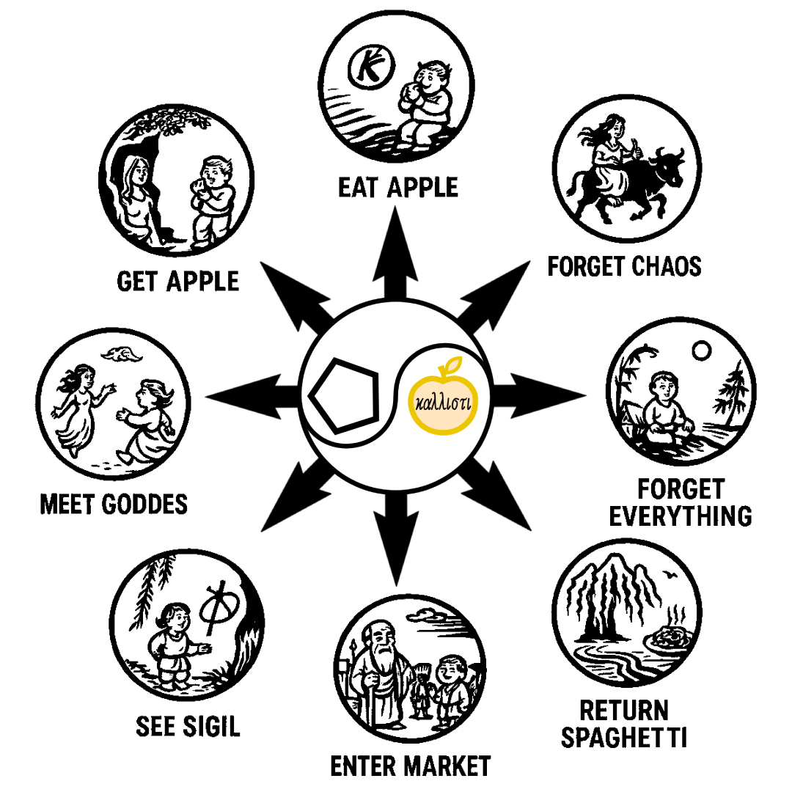
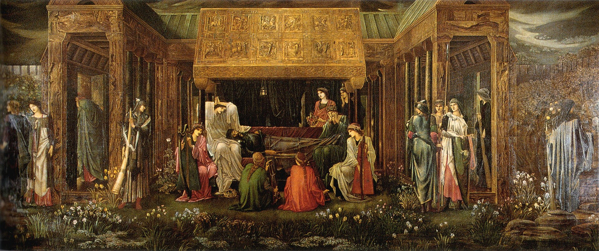

# 🍏 Discordian Magick Archive 🇬🇧/🇯🇵

[Japanese site is here!🇯🇵](https://github.com/ravensgate-tux/Discordianism_ksc/blob/main/README.md) 
Welcome to the "Discordian Magick Archive", a repository inspired by the spirit of Eris and POEE.  
Keepers of Sacred Chao (KSC) — an archive for collecting, studying, and sharing Discordian ideas and practices.  

 

 

  This page is maintained by ravensgate (KSC) a.k.a. Le Sorcier Inconnu. 
<a href="https://github.com/ravensgate-tux/spareA-spareB/blob/main/README.md">
👉 Spare A vs Spare B: Investigating a Divided Legacy (English)
</a>

 

---

 

Circulation Diagram of the Discordian Soul via Eight Directions (The Quest for the Holy Grail = The Golden Apple) 

 

 

One begins in the manner of A.O.S., by gazing into the sigil until the boundaries of Zos dissolve and the gate of Kia opens; from this aperture arises Discordia herself, the laughing Goddess, placing in the hand the golden apple. To eat it is to hail Eris within one’s own flesh, to embody the paradox of chaos,🌀 and then to forget chaos, and finally to forget everything, slipping into the Neither-Neither. Yet this is no nihilistic disappearance: from the void bubbles forth spaghetti🍝 and wine🍷, laughter and play, the delight of simple things. And so the magus returns to the marketplace, bearing the taste of Kia, guiding others while still tangled joyfully in the threads of Discordia.🍏

For Discordians🍏, the Holy Grail🏆 is “art”🧙‍♂️ 
  

And the Isle of Avalon, where King Arthur sleeps, is called in Celtic ‘the Isle of the Golden Apple’. 
  (Source: Joseph Campbell, The Myth of the Holy Grail) 

---

## 📡 Latest News

- [ 💻 Class → Instance Design: Design Principles for Safe Symbolic Operation in Modern Magic (December 29, 2025)](https://github.com/ravensgate-tux/Discordianism_ksc/blob/main/class-to-instance.md)
  
- [ 🐝 Yule Ritual Released at the SOL-Style Hecate Temple (December 14, 2025)](https://github.com/ravensgate-tux/Discordianism_ksc/blob/main/Hecate_Yule_SOL.md)

- 🗝️ [Hekate Chant Guidebook (November 29, 2025)](https://github.com/ravensgate-tux/hekate-chants/blob/main/README.md)

- [🧙‍♂️ Hikaruland announces new publications: "The Book of Pleasure" and "The Curse of Zos" by Spare, the creator of sigil magic (November 16, 2025)](https://www.amazon.co.jp/%E3%82%B7%E3%82%B8%E3%83%AB%E9%AD%94%E8%A1%93%E3%81%AE%E5%89%B5%E5%A7%8B%E8%80%85%E3%82%B9%E3%83%9A%E3%82%A2%E3%81%AE-%E3%80%8E%E5%BF%AB%E6%A5%BD%E3%81%AE%E6%9B%B8%E3%80%8F%E3%80%8E%E3%82%BE%E3%82%B9%E3%81%AE%E5%91%AA%E8%A9%9B%E3%80%8F-%E3%82%AA%E3%83%BC%E3%82%B9%E3%83%86%E3%82%A3%E3%83%B3%E3%83%BB%E3%82%AA%E3%82%B9%E3%83%9E%E3%83%B3%E3%83%BB%E3%82%B9%E3%83%9A%E3%82%A2/dp/4867425710/ref=sr_1_3?dib=eyJ2IjoiMSJ9.InZD-2DTzoirFwcQvYAHEg.DCeKpuSucbevzNO2bMcUt3o9h1pUGJ5SXLRohlqx0eY&dib_tag=se&qid=1763304390&s=books&sr=1-3&text=%E7%9F%A5%E3%82%89%E3%82%8C%E3%81%96%E3%82%8B%E5%91%AA%E8%A1%93%E5%B8%AB)

 

- [ 🐝 Release of the Samhain Ritual at the SOL-style Temple of Hecate（October 21, 2025）](https://github.com/ravensgate-tux/Discordianism_ksc/blob/main/Hecate_Samhain_SOL.md)
- [⛩️🦊 Inari Rite of Longevity and Prosperity（October 11, 2025） ](https://github.com/ravensgate-tux/Discordianism_ksc/blob/main/Inari_Rite_of_Longevity_and_Prosperity.md)
- [🎵Release of Shavin's Engram Magic (October 9, 2025)](https://github.com/ravensgate-tux/Discordianism_ksc/blob/main/sherwin-engram-magick-ja.md)
- [🧙‍♂️ Release of the SOL (Servants of the Light) Ritual System and Spiritual Education Structure（October 7, 2025）](https://github.com/ravensgate-tux/Discordianism_ksc/blob/main/SOL_TSS_lineage.md)
- [🍏 Updated sigil generation method using Transitus Fluvii (The River-Crosser) from the book of Backland（October 4, 2025）](https://github.com/ravensgate-tux/passing_river/blob/main/README.md)
- [🧙‍♀️ Release of the Nine Knots Spell（October 3, 2025）](https://github.com/ravensgate-tux/Discordianism_ksc/blob/main/nine_knots_spell.md)
- [🍏 Official Website of the Japan Discordian Association Launched (September 29, 2025)](https://www.discordianism-society-japan.com/%E3%83%9B%E3%83%BC%E3%83%A0)
- [🍏 Release of the Japanese Wikipedia for the Discordian Calendar (September 24, 2025)](https://ja.wikipedia.org/wiki/%E3%83%87%E3%82%A3%E3%82%B9%E3%82%B3%E3%83%BC%E3%83%87%E3%82%A3%E3%82%A2%E3%83%B3%E6%9A%A6)
- 🎃 The Great Secret Art ‘Pumpkin🎃 Reading’ Begins Operation (September 24, 2025) As the ultimate secret art, it will not be made public.
  

 

- [🐝 Observation and Re-creation Work / The Dolores Method（September 23, 2025）](https://github.com/ravensgate-tux/Discordianism_ksc/blob/main/dolores-observation.md)
- [🏰 Memory Palace Workshop / The Harvey Brennan Method (September 23, 2025)](https://github.com/ravensgate-tux/Discordianism_ksc/blob/main/brennan-mindpalace.md)
- [🏰 Pre-cleaning work for path-making using the castle（September 23, 2025）](https://github.com/ravensgate-tux/Discordianism_ksc/blob/main/castle_clean.md)
- [🎲 Release of Dice visualization training（September 21, 2025）](https://github.com/ravensgate-tux/Discordianism_ksc/blob/main/%E3%82%B5%E3%82%A4%E3%82%B3%E3%83%AD%E8%A6%96%E8%A6%9A%E5%8C%96%E3%83%88%E3%83%AC%E3%83%BC%E3%83%8B%E3%83%B3%E3%82%AF%E3%82%99.md)
- [🐝 Release of the Japanese Wikipedia entry for W. E. Butler（September 18, 2025)](https://ja.wikipedia.org/wiki/W%E3%83%BBE%E3%83%BB%E3%83%90%E3%83%88%E3%83%A9%E3%83%BC)
  
- [🌀 Release of the Japanese Wikipedia entry for Lionel Snell（September 18, 2025)](https://ja.wikipedia.org/wiki/%E3%83%A9%E3%82%A4%E3%82%AA%E3%83%8D%E3%83%AB%E3%83%BB%E3%82%B9%E3%83%8D%E3%83%AB)

- [🐐 Release of Phil Hein's Japanese Wikipedia entry (September 18, 2025)
  ](https://ja.wikipedia.org/wiki/%E3%83%95%E3%82%A3%E3%83%AB%E3%83%BB%E3%83%8F%E3%82%A4%E3%83%B3)
  
- [🍏 Release of the Japanese Wikipedia edition of Discordianism（September 17, 2025）](https://ja.wikipedia.org/wiki/%E3%83%87%E3%82%A3%E3%82%B9%E3%82%B3%E3%83%BC%E3%83%87%E3%82%A3%E3%82%A2%E3%83%8B%E3%82%BA%E3%83%A0)
  
- [🏰 Guillermo del Toro's film Passworking (September 12, 2025)](https://github.com/ravensgate-tux/Discordianism_ksc/blob/main/deltoro_pathworking.md)
  
- 🍏 SPARE AND CATS: Release Date (September 1, 2025)

 

- [🍏 The Bookcase Temple Recommendation (September 10, 2025)](https://github.com/ravensgate-tux/Discordianism_ksc/blob/main/BookshelfTemple.md)
- [🏰 Arthurian Symbolism: Pathworking with Beardsley's Illustrations (September 7, 2025)](https://github.com/ravensgate-tux/Discordianism_ksc/blob/main/king_Arthur_path.md)

- [🏰 Monty Python and the Holy Grail has been added to the Discordian Film Library.（September 6, 2025）😆](https://ja.wikipedia.org/wiki/%E3%83%A2%E3%83%B3%E3%83%86%E3%82%A3%E3%83%BB%E3%83%91%E3%82%A4%E3%82%BD%E3%83%B3%E3%83%BB%E3%82%A2%E3%83%B3%E3%83%89%E3%83%BB%E3%83%9B%E3%83%BC%E3%83%AA%E3%83%BC%E3%83%BB%E3%82%B0%E3%83%AC%E3%82%A4%E3%83%AB)

- [🍏 Discordianism in Two Minutes（September 4, 2025）](https://www.youtube.com/watch?v=dFjaCGx6g5Y)
- 🍏 Non-periodical: Apple Newspaper launch（September 1, 2025)

 

 

- [🍏 Daruma Magic ver.1（August 31, 2025）](https://github.com/ravensgate-tux/Discordianism_ksc/blob/main/daruma-magic-jp.md)
- [🍏 Link to POEE Priest's no+e launched (August 31, 2025)](https://note.com/tramal)
- [✏️ English-speaking Region Report: Findings Released on Removing Duplicate Characters During Sigil Creation (August 29, 2025)](https://github.com/ravensgate-tux/Discordianism_ksc/blob/main/chaos_sigils_letter_elimination.md)
- [🍏 Sigil Making Without Removing Duplicate Letters（August 29, 2025）](https://github.com/ravensgate-tux/sigil_duplicates/blob/main/README.md)

 

- [🌀 Daruma Sigil is released - English (August 26, 2025)](https://github.com/ravensgate-tux/daruma_sigil/blob/main/README.md)

 

- [📺 The Channel of the Unknown Sorcerer - YouTube (August 24, 2025) ](https://www.youtube.com/@ravensgate-v5s)
- [🍏 LIBER SPAGHETTI (August 15, 2025）](https://github.com/ravensgate-tux/Discordianism_ksc/blob/main/LIBER_SPAGHETTI_TOC.md)
- [🍏 Transitus Fluvii Sigil (August 12, 2025）](https://github.com/ravensgate-tux/passing_river/blob/main/README.md)
- [🍏 Eris Pentacle Visualization（August 11, 2025）](https://github.com/ravensgate-tux/Discordianism_ksc/blob/main/Eris_pentacle_visualization_training.md)
- [🍏 Apple Melting Contemplation of Eris（August 10, 2025）](https://github.com/ravensgate-tux/Discordianism_ksc/blob/main/apple_melting_contemplation_of_eris.md)
- [🍏 Apple Contemplation of Eris（August 9, 2025）](https://github.com/ravensgate-tux/Discordianism_ksc/blob/main/discordian_apple_contemplation.md)
- [🍏 Erisian Banishing Ritual （August 8, 2025）](https://github.com/ravensgate-tux/Discordianism_ksc/blob/main/erisian_banishing_ritual.md)
- [🐜 HEX THE PESTS! Spare’s Sigils in Your Spray Bottle（August 7, 2025）](https://github.com/ravensgate-tux/Discordianism_ksc/blob/main/2025-08-07_sigil_spray.md)
- 🍎 PINK PERIL! Chaos Grenade Goes Public (July 29, 2025)

 
<ul>
  <li>🐐 <a href="https://enfolding.org/out-now-delinquent-elementals/">NEW FROM PHIL HINE! Delinquent Elementals Out Now (Mar 25, 2025)</a></li>
</ul>

---

## What is Discordianism?
- A modern parody religion centered around chaos and humor
- Worship of Eris 🍏, goddess of chaos and strife
- Encourages free thought, satire, and playful subversion
- Connects with wider countercultural and magical traditions
<ul>
<li>🐐 <a href="https://occultlibrary.wiki.fc2.com/wiki/%E3%81%99%E3%81%90%E3%82%8F%E3%81%8B%E3%82%8B%E6%B7%B7%E6%B2%8C%E9%AD%94%E8%A1%93%203">ALL Hail Discordia! (OVEN-READY CHAOS) - existing translation by others</a></li>
</ul>
<ul>
<li>🌀 <a href="https://www-principiadiscordia-com.translate.goog/book/1.php?_x_tr_sl=en&_x_tr_tl=ja&_x_tr_hl=ja&_x_tr_pto=wapp">Principia Discordia (official) - 🇯🇵 Google trandlation</a></li>
</ul>

---

## Core Concept
This project is based on the ideas in Phil Hine’s *Prime Chaos*, focusing on the philosophy, practice, and history of Discordianism.  
Our aim is to introduce, translate, and develop these concepts in Japanese.

- [🐐 Aspects of Evocation (Phil Hine) - translations and notes by KSC](https://github.com/ravensgate-tux/hine_evocation/blob/main/README.md)
- [🐐 Modern Shamanism vol.1 (Phil Hine) - translations and notes by KSC](https://github.com/ravensgate-tux/hine_modern_shamanism/blob/main/README.md)
- [🌀 Art Magick (DKMU & others) - translations and notes by KSC](https://github.com/ravensgate-tux/Discordianism_ksc/blob/main/artist_magic_jp.md)
- [🕶 POP MAGIC! (Grant Morrison) - translations and notes by KSC](https://github.com/ravensgate-tux/pop_magic_annotation/blob/main/README.md)
- [🕶 BATMAN R.I.P. (Grant Morrison) - translations and notes by KSC](https://github.com/ravensgate-tux/batman_rip_zine/blob/main/README.md)

---

## Other Resources

<ul>
  <li>🐐 <a href="https://occultlibrary.wiki.fc2.com/wiki/%E3%81%99%E3%81%90%E3%82%8F%E3%81%8B%E3%82%8B%E6%B7%B7%E6%B2%8C%E9%AD%94%E8%A1%93">OVEN-READY CHAOS (Phil Hine) - existing translation by others</a></li>
</ul>

<ul>
  <li>🐐 <a href="https://github.com/ravensgate-tux/hine_ganesha_morphing/blob/main/README.md">Ganesha morphing (Phil Hine) - translated and notes by KSC</a></li>
</ul>

- [🗝️ Hekate Chant Guidebook](https://github.com/ravensgate-tux/hekate-chants/blob/main/README.md)
- [🎨 Earth Inferno (A.O.Spare) - translations and notes by KSC](https://github.com/ravensgate-tux/earth_inferno/blob/main/README.md)
- [🎨 A Book of Satyrs (A.O.Spare) - translations and notes by KSC](https://github.com/ravensgate-tux/book_satyrs/blob/main/README.md)
- [🎨 The Book of Pleasure (A.O.Spare) - translations and notes by KSC](https://github.com/ravensgate-tux/book_of_pleasure/blob/main/README.md)
- [🎨 The Focus of Life (A.O.Spare) - translations and notes by KSC](https://github.com/ravensgate-tux/focus-of-life/blob/main/README.md)
- [🎨 Anathema of Zos (A.O.Spare) - translations and notes by KSC](https://github.com/ravensgate-tux/Anathema_of_Zos/blob/main/README.md)
- [🍏 Invoking Eris Ritual (August 12, 2025）](https://github.com/ravensgate-tux/Discordianism_ksc/blob/main/ritual_invoking_eris.md)
- [🍏 Power of One Ritual foe Eris (August 11, 2025）](https://github.com/ravensgate-tux/Discordianism_ksc/blob/main/ritual_power_of_one_ish.md)
  
---

 

## KSC Discordian Magick Archive
**with TRANSLATIONS & NOTES by**  
Keeper of Sacred Chaos (KSC)  

Assembled by His Obliqueness the Rev DrKSC  
on behalf of  
The Committee for Uncontrolled Reality Manipulation  

---

**Approved for misuse in magical circles**

> Give me your chaos, your satire,  
> Your weird masses yearning to hex free,  
> The blessed refuse of your sigil-stained shrines —  
> This Archive always needs more paradox.  

**HAIL ERIS! – καλλιχᾰ – ALL HAIL DISCORDIA!**

(K) 2025 ALL RITES REVERSED  
REPRINT WHAT YOU LIKE, REMIX WHAT YOU CAN’T
